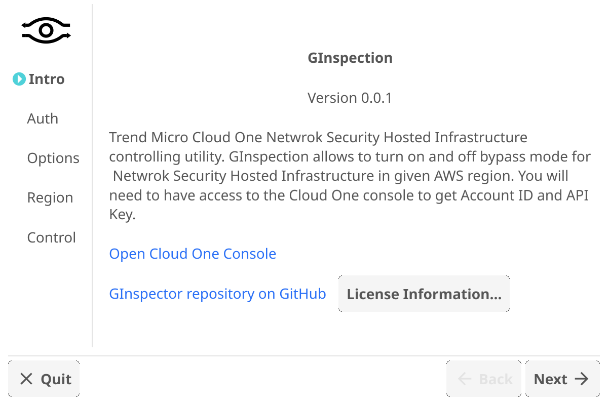
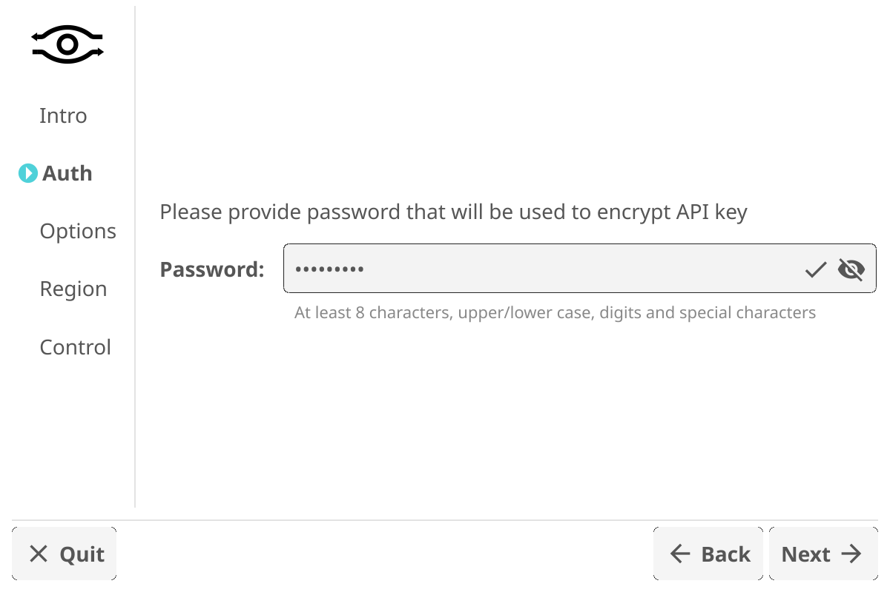
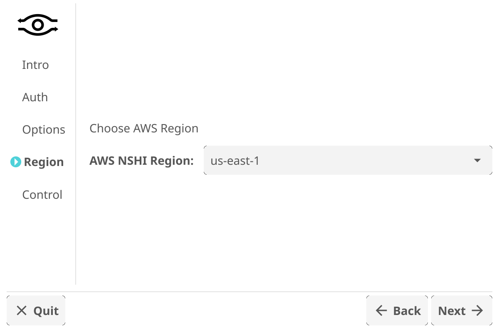
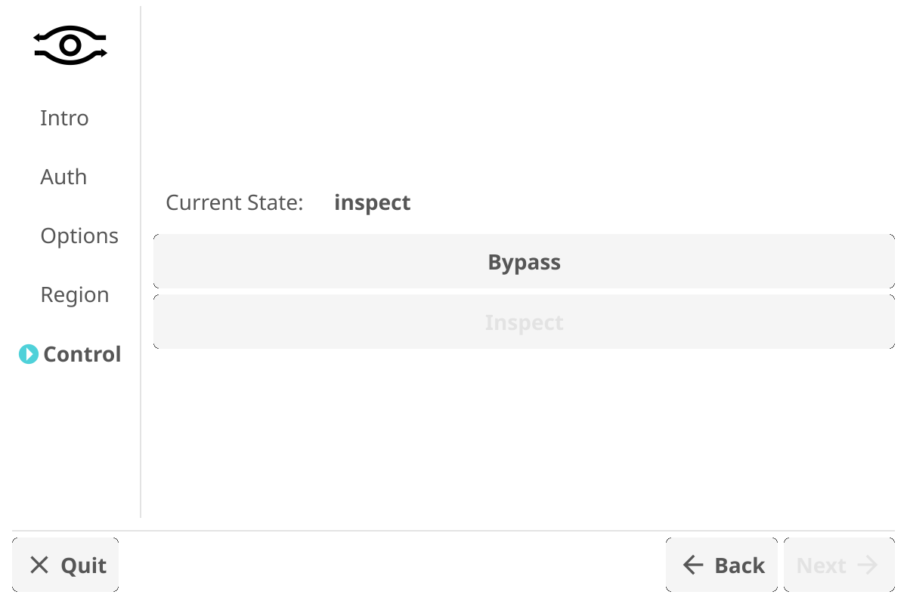

# Inspection

Control Trend Micro Cloud One Network Security Hosted Infrastructure inspection on AWS.

<p>
 For network issues diagnostic, it is very often needed to temporary turn off IPS inspection. For Trend Micro Cloud One Network Security Hosted Infrastructure, this option is not available on the management console. Inspection offers this ability as a command line utility.</p>


 Code is released under [CC BY license](https://creativecommons.org/licenses/by/4.0/)

## Usage 
Inspection offers following options to control Network Security Hosted Infrastructure bypass mode:
1. [GUI application GInspection](#GInspection)
2. [Inspection CLI Utility](#Inspection-CLI-Utility)
3. [AWS Lambda function](#Use-as-AWS-Lambda)

## GInspection

To run GInspection download [the latest release](https://github.com/mpkondrashin/inspection/releases/latest) of ```GIspection``` executable for your platform and run it.

**Note:** GInspection is not signed, so for macOS one of the solutions to run it to use terminal and run following command:
```commandline
sudo xattr -r -d com.apple.quarantine  GInspection.app
```
<p align="center"><kbd></kbd></p>
<p align="center">On introduction screen press "Next" button.</p>
<p align="center"><kbd></kbd></p>
<p align="center">Provide password that will be used to encrypt/decrypt saved Cloud One API key.</p>
<p align="center"><kbd></kbd></p>
<p align="center">Open Cloud One console to get required parameters (see below).</p>
<p align="center"><kbd></kbd></p>
<p align="center">Pick the AWS region in which you want to control bypass mode. GInspection is detecting regions with deployed NSHI and picks one of them.</p>
<p align="center"><kbd></kbd></p>
<p align="center">Push "bypass" button to cancel all Network Security inspection. Push "Inspect" button to return Network Security to its normal operation.</p>

## Inspection CLI Utility

### Get required configuration parameters
To use Inspection utility you will need to get values of several parameters:
1. Cloud One Region
2. Cloud One Account ID
3. Cloud One API Key
4. AWS Region

For Cloud One **Region** and **Account ID** open [Cloud One console](https://cloudone.trendmicro.com/home) scroll page to the bottom and click "Administration". On the Account Settings page look for **ID** and **Region** values:


For Cloud One **API Key**, go to API Keys and push "New" button:


Choose Full Control if you need to change fallback mode and not only check its status:


For correct **AWS Region** value, go to Network Security -> Network -> Hosted Infrastructure


and pick your AWS VPC:


**AWS Region** value is Availability Zone without last character ("a" in this example)

### Get latest Inspection executable
Download [the latest release](https://github.com/mpkondrashin/inspection/releases/latest) of ```inspection``` executable for your platform.

### Create Configuration File
Copy ```config_example.yaml``` to ```config.yaml``` in the same directory as Inspection executable itself. Edit ```config.yaml``` and change fields to values aquired on the previous steps. 

### Run Inspection Utility
Run ```inspection``` executable with one of following commands: status, on, off.

**Note:** Inspection executable is not signed application, so operating system may warn you on this. In this case this warning can be ignored.

## Configuration
Inspection offers the following ways to provide configuration parameters:
1. Configuration file ```config.yaml```. Application seeks for this file in its current folder or folder of executable
2. Environment variables
3. Command line parameters

Full config file explained:
```yaml
api_key:    # Cloud One API key (On Cloud One console go to Administration->API Keys->New)
region:     # Cloud One region (On Cloud One console go to Administration-Account Settings->Region)
account_id: # Cloud One account ID (On Cloud One console go to Administration-Account Settings->ID)
aws_region: # AWS region, i.e. us-east-1
```

To set these parameters through the command line, for example, to set AWS Region, use the following command line option:
```commandline 
inspection status --aws_region=us-east-1
```

To set these parameters through the environment variable, add "NS_" prefix. Example for the API Key:
```commandline
NS_API_KEY=tmc12YddE43ASdreseZYhJ5jWAWgaHwBn:5NosR4ed4sdRwe4wfgTYerpedqexms3D14XdqAd8Q5vjcc62irGPHG2weWnh
```

## Inspection Utility Output Examples

Turn inspection off:
```commandline
$./inspection off
2023/11/24 21:35:29 Command: off
2023/11/24 21:35:30 Done
```

Turn inspection on:
```commandline
$./inspection on
2023/11/24 21:35:29 Command: on
2023/11/24 21:35:30 Done
```

### Status Command

Inspection is on:
```commandline
$./inspection status
2023/11/24 21:32:18 Command: status
2023/11/24 21:32:19 Action: inspect
2023/11/24 21:32:19 Status: success
2023/11/24 21:32:19 Last change: 2023-11-24 21:09:50 +0200 IST
2023/11/24 21:32:19 Done
```

Inspection is off:
```commandline
$./inspection status
2023/11/24 21:36:41 Command: status
2023/11/24 21:36:42 Action: bypass
2023/11/24 21:36:42 Status: success
2023/11/24 21:36:42 Last change: 2023-11-24 21:35:31 +0200 IST
2023/11/24 21:36:42 Done
```

## Errors

| Error message                                               | Possible Cause                                                              |
|-------------------------------------------------------------|-----------------------------------------------------------------------------|
| Unauthorized                                                | Wrong Cloud One API key or Cloud One region                                 |
| This request is invalid                                     | Wrong format of Cloud One account or AWS Region                             |
| Forbidden                                                   | Wrong Cloud One account                                                     |
| Data not found                                              | Wrong AWS Region                                                            |
| HTTP request: Get "...": dial tcp: lookup ...: no such host | Nonexistent region or missing Internet connection                           |
| Missing ...                                                 | Given option is missing in config.yaml, environment, and commandline        |

## Use as AWS Lambda

To run inspection as Lambda on your AWS account, [deploy following Cloud Formation stack](https://mpkondrashin-lambdastorage.s3.amazonaws.com/gh/deploy.html). After deployment will finish, run Lambda manualy using Test button. Each Lambda run will switch inspection on and off.
